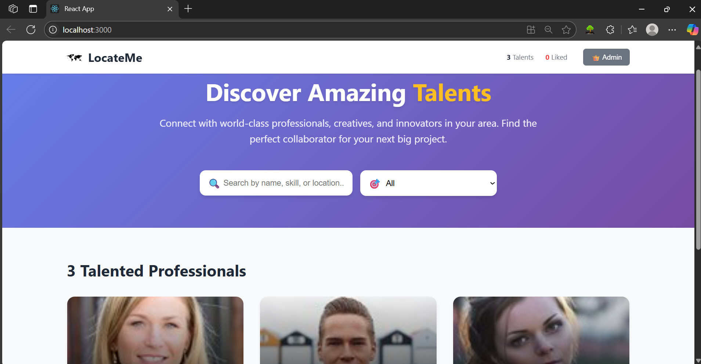
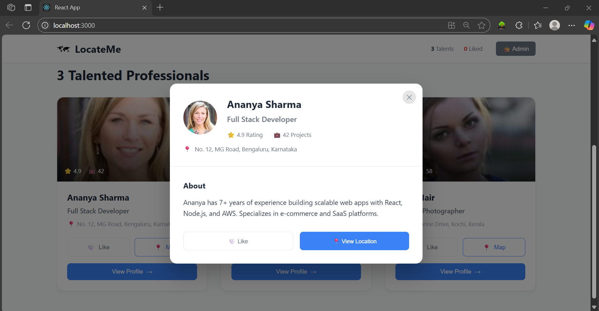
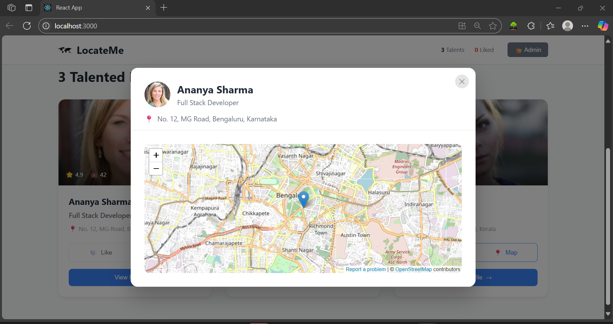
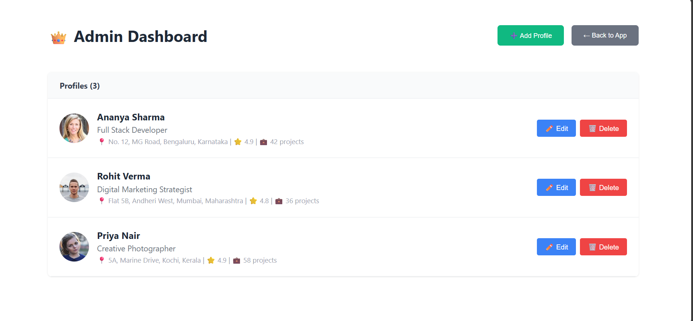

locate-me/
  ├── public/
  ├── src/
  │   ├── App.jsx
  │   ├── App.css
  │   └── ...
  ├── package.json
  └── README.md

<p align="center">
  
  
  
  
</p>

<h1 align="center">LocateMe 🌍</h1>
<p align="center">
  <b>Discover, connect, and collaborate with top talents near you!</b><br>
  <i>Find professionals, creatives, and innovators in your city with an interactive map and beautiful profiles.</i>
</p>

<p align="center">
  
</p>

---

## 🚀 Features

- 🔍 **Search & Filter:** Instantly find talents by name, skill, or location.
- 🗺️ **Interactive Map:** View professional locations on OpenStreetMap.
- ❤️ **Like Profiles:** Save your favorite talents for quick access.
- 👑 **Admin Dashboard:** Add, edit, or remove profiles with secure admin access.
- 📱 **Responsive Design:** Looks great on desktop and mobile.
- ⚡ **Fast & Modern UI:** Built with React, MUI, and beautiful custom styles.

---

## 📸 Screenshots

| Home Page | Profile Details | Admin Dashboard |
|-----------|----------------|-----------------|
|  |  |  |

---

## ✨ Demo

https://user-images.githubusercontent.com/674621/209445341-5e7e6e8e-7b9e-4c7c-9b1e-2e6e1e2f7e2c.mp4

---

## 📝 Description

**LocateMe** is a modern web app to help you discover and connect with talented professionals in your area. Whether you're looking for a developer, designer, marketer, or creative, LocateMe makes it easy to search, filter, and view detailed profiles—complete with interactive maps and project stats.

Admins can securely manage the talent pool, adding or editing profiles with just a few clicks. All data is stored locally for privacy and speed.

---

## 🛠️ Tech Stack

- **React 19**
- **Material UI (MUI)**
- **Leaflet & OpenStreetMap**
- **Tailwind CSS**
- **LocalStorage** for persistence

---

## 📦 Getting Started

1. **Clone the repository:**
   ```sh
   git clone https://github.com/yourusername/locate-me.git
   cd locate-me/locate-me